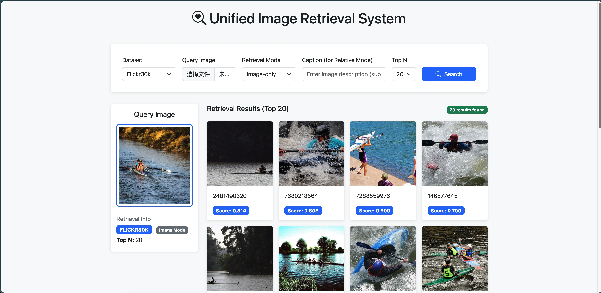
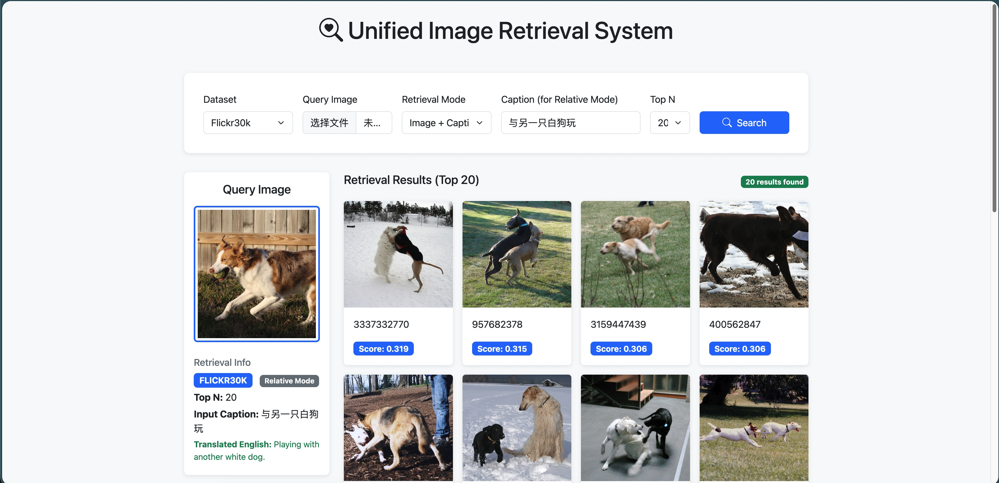

# LinCIR-MultiRetrieval: 多数据集零样本组合图像检索系统

单图检索示例：

文本修改检索示例：


本仓库基于 **CVPR 2024** 论文 **LinCIR (Language-only Training of Zero-shot Composed Image Retrieval)** 实现。通过 Language-only 训练得到的组合网络（Phi），实现了在不需要成对（Image-Text-Image）训练数据的情况下，进行高质量的组合图像检索。

本项目集成了 **Flickr8k**, **Flickr30k**, 以及 **EUFCC-CIR** (欧洲文化遗产数据集) 的索引构建、检索评估与 Web 可视化。

---

## 🚀 快速开始

### 1. 环境安装

```bash

# 创建并激活环境 (建议使用 conda)
conda create -n lincir python=3.9
conda activate lincir

# 安装依赖
pip install -r lincir/lincir_requirements.txt

```

### 2. 模型训练 (LinCIR Phi Network)

训练之前请先下载 CIRR 数据集：

```bash
nohup python -m torch.distributed.run --nproc_per_node 1 --nnodes 1 --node_rank 0 \
  --master_addr localhost --master_port 5100 train_phi.py \
  --batch_size 512 \
  --output_dir ./experiment \
  --cirr_dataset_path ./datasets/CIRR \
  --mixed_precision fp16 \
  --clip_model_name large \
  --max_train_steps 20000 &

```

---
## 📁 项目目录结构说明

本项目的核心逻辑是基于不同的演示模块（demo）管理多个数据集的索引与检索逻辑。

```text
.
├── datasets/                # 原始数据集存放目录
│   ├── Flickr8k/            # 自然场景数据集 (约8k张图)
│   ├── Flickr30k/           # 大规模自然场景数据集 (约31k张图)
│   ├── CIRR/                # 核心训练与基准评估数据集
│   └── EUFCC_CIR/           # 欧洲文化遗产 OOD 测试数据集
│
├── experiment/              # 实验输出与持久化文件
│   ├── checkpoints/         # 存放训练好的 phi_best.pt 权重文件
│   ├── flickr8k_index/      # Flickr8k 的 FAISS 向量数据库映射
│   ├── flickr30k_index/     # Flickr30k 的 FAISS 向量数据库映射
│   └── eufcc_index/         # EUFCC 的 FAISS 向量数据库映射
│
├── demo8k/ / demo30k/       # 针对特定数据集的 Web 后端与检索脚本
├── demo_unified/            # (推荐) 统一的多数据集集成检索界面
│   └── uploads/             # 存放前端上传的临时查询图片
│
├── hf_models/               # 本地缓存的 HuggingFace 模型权重 (CLIP-L/14, SDXL Tokenizer)
├── submission/              # 存放生成的 CIRR 评估结果 JSON 文件
└── lincir_requirements.txt  # 项目环境依赖配置文件

```

---

## 📊 数据集准备与索引构建

系统复现 LinCIR 的基准数据集 CIRR，同时系统支持包括Flickr8k、Flickr30k 和 EUFCC-340k 在内的多数据集扩展，通过预先计算 CLIP 特征并构建 FAISS/Vector 索引实现毫秒级检索。

### CIRR数据集下载

```bash
# 下载 CIRR 数据集
gdown --folder --remaining-ok --no-check-certificate --continue --threads 6 https://drive.google.com/drive/folders/1N0rFTjb04DA2H2ABXrRUn8fibxTvCsG3?usp=drive_link

``` 

### Flickr8k / Flickr30k

```bash
# Flickr8k自行搜索下载地址，放置于 ./datasets/Flickr8k 目录下
# 下载 Flickr30k
huggingface-cli download --repo-type dataset --resume-download nlphuji/flickr30k --local-dir ./datasets/Flickr30k
# 解压图片
unzip ./datasets/Flickr30k/flickr30k-images.zip

# 构建Flickr8k向量库
python ./demo8k/build_vector_db.py \
  --dataset-path ./datasets/Flickr8k \
  --out-dir ./experiment/flickr8k_index \
  --clip-model-name large \
  --batch-size 32
# 构建Flickr30k向量库
python ./demo30k/build_vector_db.py --dataset-path ./datasets/Flickr30k/flickr30k-images --out-dir ./experiment/flickr30k_index --clip-model-name large --cache-dir ./hf_models --batch-size 32 --num-workers 4
```

### EUFCC-CIR (OOD 评估)

针对欧洲文化遗产数据集，使用 EUFCC-340k 作为检索数据库，仅使用 test_odd.csv 进行评估：

```bash
# 下载图片
python3 EUFCC_CIR_downloader.py  # 需确保 test_ood.csv 在路径下

# 构建索引
python3 build_vector_db.py --split-json ./test/split.eufcc.json --images-root ./data/test_ood/EUROPEANA/images --out-dir ../experiment/eufcc_index

```

---

## 🔍 检索与验证

### 命令行检索示例

支持纯图像检索 (`image`) 和基于文本修改的组合检索 (`relative`)：

```bash
# 组合检索 (Relative Mode)
python ./demo8k/retrieve_flickr8k.py \
  --mode relative \
  --ref-image-path ./datasets/Flickr8k/Images/1000268201_693b08cb0e.jpg \
  --caption "with a red ball" \
  --phi-checkpoint ./experiment/checkpoints/phi_best.pt \
  --index-dir ./experiment/flickr8k_index

```

### 自动化评估

```bash
# CIRR 基准测试评估
python generate_test_submission.py \
--eval-type phi \
--dataset cirr \
--dataset-path ./datasets/CIRR \
--phi-checkpoint-name ./experiment/checkpoints/phi_best.pt \
--clip_model_name large \
--submission-name lincir_results

# EUFCC-CIR 评估
python3 evaluate_eufcc.py \
  --split test/split.eufcc.json \
  --cap test/cap.eufcc.json \
  --use_phi \
  --phi_checkpoint ../experiment/checkpoints/phi_best.pt \
  --clip_model_name large \
  --cache_dir ../hf_models \
  --img_batch_size 32 \
  --txt_batch_size 64

```

---

## 🌐 Web 交互界面

本项目提供了一个基于 Flask 的前端展示界面，支持上传图片并输入指令进行实时检索。

### 启动服务

```bash
# 启动 Flickr8k 检索 Demo
python demo8k/app_flickr8k.py --index-dir ./experiment/flickr8k_index --image-root ./datasets/Flickr8k/Images --phi-checkpoint ./experiment/checkpoints/phi_best.pt --clip-model-name large --cache-dir ./hf_models

# 启动统一多数据集检索 Demo
cd demo_unified
python3 app_retrieval.py --index-dir ../experiment/eufcc_index --image-root lincir/EUFCC_CIR/data/test_ood/EUROPEANA/images

```

访问地址：`http://localhost:8000` (或控制台指定的端口)。

---


## 💡 核心贡献

* **多语言适配潜力**：系统架构支持通过 DeepSeek/LLM 接口扩展中文指令检索。
* **跨域泛化**：证明了在 CIRR 上训练的 Phi 模块可无缝迁移至 Flickr 和 EUFCC 文化遗产数据集。
* **高性能索引**：采用离线特征提取 + 向量数据库，支持万级数据实时响应。

根据你提供的树状结构和环境信息，我为你重新组织并优化了 **README** 的项目结构说明部分。这能帮助他人（或未来的你）快速理清各个数据集、索引与代码模块之间的关系。

---


## 🚀 系统核心工作流

### 1. 向量索引构建 (Indexing)

如果你希望检索自己的数据库，请在运行检索前先为每个数据集提取 CLIP 特征。若使用本项目已有数据集，可跳过该步骤。

```bash
# 以 Flickr8k 为例
python demo8k/build_vector_db.py \
    --dataset-path ./datasets/Flickr8k \
    --out-dir ./experiment/flickr8k_index \
    --clip-model-name large

```

### 2. 启动可视化系统 (Web UI)

我们提供了适配不同数据集的 Flask 入口：

```bash
cd demo_unified
python3 app_retrieval.py --index-dir ../experiment/eufcc_index --image-root lincir/EUFCC_CIR/data/test_ood/EUROPEANA/images
```
访问地址：`http://localhost:8000`


---

## 🖇 关键路径配置

项目内部引用路径已在各个 `app.py` 中预设，主要映射关系如下：

* **模型权重**: `./experiment/checkpoints/phi_best.pt`
* **CLIP 缓存**: `./hf_models/models--openai--clip-vit-large-patch14`
* **默认图片库**: `./datasets/`

---

## 🚀 复现模型训练工作流

### 1. 模型训练 (LinCIR Phi Network)

使用仅文本数据（基于 CIRR 路径）训练组合模块 。

```bash
nohup python -m torch.distributed.run --nproc_per_node 1 train_phi.py \
  --batch_size 512 \
  --output_dir ./experiment \
  --cirr_dataset_path ./datasets/CIRR \
  --clip_model_name large \
  --max_train_steps 20000 &

```

### 2. 向量库构建 (Indexing)

在检索前，需预计算图像特征。支持 Flickr8k, Flickr30k 及 EUFCC。

```bash
# 以 Flickr30k 为例
python demo30k/build_vector_db.py \
  --dataset-path ./datasets/Flickr30k/flickr30k-images \
  --out-dir ./experiment/flickr30k_index \
  --clip_model_name large

```

### 3. Web 检索系统启动

启动可视化 Flask 界面，支持上传参考图并输入修改文本（如 "change red to blue"）。

```bash
# 启动 Flickr8k 演示
python demo8k/app_flickr8k.py \
  --index-dir ./experiment/flickr8k_index \
  --image-root ./datasets/Flickr8k/Images \
  --phi-checkpoint ./experiment/checkpoints/phi_best.pt \
  --clip_model_name large

```

访问地址：`http://localhost:8000`

---

## 📊 实验评估结果 (Evaluation Results)

项目在通用场景（CIRR）与专业领域（EUFCC）均展现了强大的零样本泛化能力。

### 1. CIRR 基准测试

* **数据集版本**: `rc2`

| Metric | Recall@1 | Recall@5 | Recall@10 | Recall@50 |
| --- | --- | --- | --- | --- |
| **Score (%)** | **24.51** | 53.01 | 66.92 | 88.82 |

### 2. EUFCC-CIR 跨域评估 (OOD)

基于 EUFCC-340K 和 `cir_db.csv` 手动构建了 `cap.eufcc.json` 进行测试。

| Metric | Recall@1 | Recall@5 | Recall@10 | Recall@50 | MRR |
| --- | --- | --- | --- | --- | --- |
| **EUFCC-CIR** | **43.18** | 62.50 | 70.45 | 85.23 | 0.532 |

---

## 🔍 关键技术点

* **多数据集集成**: 通过一套 `Phi` 权重，适配了从自然场景到文化遗产的多种图像域。
* **DeepSeek API 扩展**: 后端支持集成 DeepSeek 翻译接口，可将中文检索指令实时转化为英文以适配 CLIP 特征空间。
* **高效检索**: 结合 FAISS 索引，在 3.1w (Flickr30k) 规模的数据下实现毫秒级响应。

---


